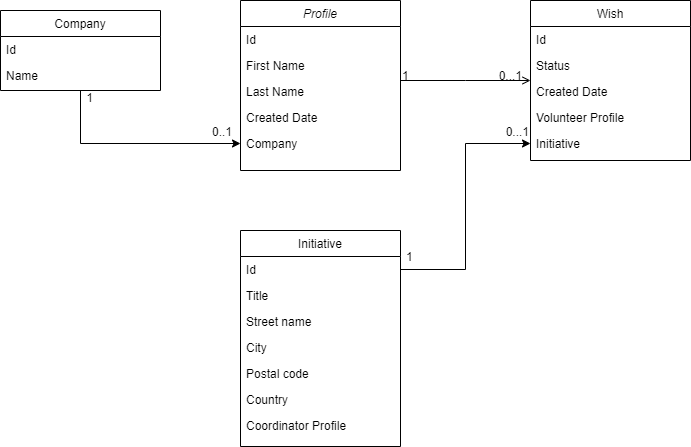

# WnbInterviewMiniProjectFullStack

## Goal

The goal of this mini project is to test your skill on a real-world case: building a new administration screen/view to
allow
associations to follow their volunteers' subscriptions.

To do that, you will have 3 resources at your disposal:

- A backend ready to use (Spring Boot 2.7.11, java 11 with h2 memory database) 
- Mockups produced by our UX designer. It also contains comments about what the view should do and what data to fetch
  from the REST API
- This source project that will help you getting started

## Project dependencies

This project has been generated using `@angular/cli@8.3.22`. Some librairies have been already installed (
see `package.json`) but you are free to use any extra librairies you may find useful to have the best interface and user
experience. However, we recommend to not use external UI libraries with existing components as we want to asset your
ability to create components/styles from scratch (HTML/CSS skills).

## Submission process

This project has been downloaded from one of Wenabi's internal repositories. Since it is already a fully functionnal
Angular application, you can start working on it right away.

However, in order for us to review your work, you will need to upload it to a public Github repository and share the
link with Wenabi's development team. We recommend to initialize the Git repository **as soon as possible** and split
your work into different commits (see [Expectations](#expectations) section).

Finally, once you are satisfied with the end result, don't forget to complete the [final feedback](feedback.md) file (
i.e `feedback.md`). This will help us assess your work objectively and improve the examination process 🙏.

## Data model

## REST API

### Retrieve wishes

- It represents a subscription (called _wish_). Each subscription is made by a user to participate in an initiative
  proposed by an association.
- A subscription is composed of different properties (e.g its status, the user's profile that subscribed and many more):
    - Subscriptions follow a straightforward process and each step of the process is identified by a
      status: `APPLICATION`, `DISCUSSION`, `WAITING_ASSOCIATION_VALIDATION`, `WAITING_MANAGER_VALIDATION`, `IN_PROGRESS`
      , `USER_HAS_PARTICIPATED`, and `CANCELLED`
- Implement the all stack from frontend to backend to retrieve wishes (only domain objects has been written)
- This resource must be queried, filtered, sorted by status of a wish:
    - For example, to get all wishes in status `APPLICATION`, call `GET /api/wishes?status=APPLICATION`.
- Some data are stored in H2 memory database (see src/main/resources/*.sql)

### Retrieve statistics

- It represents a list of the number of wishes per status.
- Implement the all stack from frontend to backend to retrieve statistics

## Mockups

You can find the mockups at the following
address: https://www.figma.com/file/f8Ix2NRBWk9wOWgNXAloXb/Recrutement-IT?node-id=1-8121&t=ybXm1hkmLkrl4k7q-0.

## Acceptance criteria

We are not looking for pixel-perfect design but the final view should be as close as possible to the initial mockups.

### Expectations

#### Backend
- Wishes and statistics resources must be implemented (from resource until repository)
- Wishes must be filtered by status (ie: `GET /api/wishes?status=APPLICATION` for example)

#### Frontend
- All changes should be tracked in a Git repository publicly available on Github.
    - It is also expected that you split your work in different commits. A single commit with all the changes is not
      practical and not recommended
- Build (without warnings or errors) and serve project using `npm start` only
- Code should be well-structured and commented as needed. It should follow Angular dev team recommandations and best
  practices
- View should not be wider than `1200px`. When displayed on very large screens (`> 1200px`), the view should be centered
- Should display nicely on small screens (i.g mobile phones and tablets, smaller than `978px`)
- Should display nicely on EdgeHTML (+ latest versions of Firefox and Chrome of course 😉)
- In any case, if either the specifications or the mockups are not clear enough or contain a mistake (it can always
  happen),
  go with what you think is best in terms of UX and leave a comment on your decisions

### Nice to have

If you feel adventurous and want to show us your dedication and passion, here is a **non-exhaustive** list of features
that can
be added to this mini project:

- Backend
  - Unit tests must be implemented
  - Implement Security layer with spring security
  
- Frontend
  - Background with linear gradient color from #FFD400 (dark yellow) to #FFD40080 (light yellow)
  - Autoscroll to wish list when clicking on status button in stats panel
  - Pagination or infinite scroll
  - Angular unit testing and/or headless browser testing
  - Anything you feel that can enhance the user experience 🚀

Keep in mind that these are not a priority and should not be developped before having a nice-looking interface, as close
to the mockups as possible !
